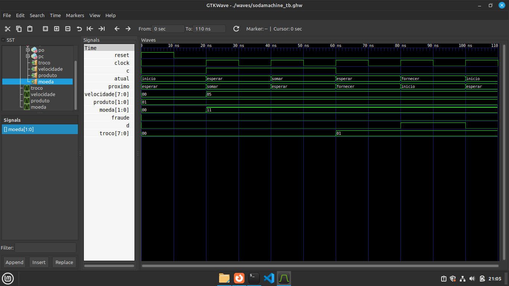

# micro

> Teste uma moeda de 1 real (11) para comprar um produto de 50 centavos (01), com uma velocidade correta da moeda (0,5 m/s = 00000101). Sendo assim, não acusa fraude e retorna um troco seguindo a logica adotada (00000001 = 50 centavos). Lembrado que os valores estão em hexadecimal, para converterlos basta apenas selecionar e alterar para binário ou decimal.

